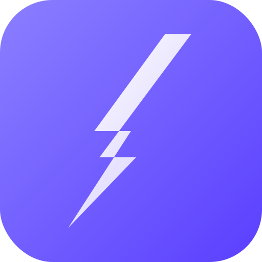

# ⚡ Rockd

> **Get things rockd.** A smart, fast checklist app with real-time sync, task groups, AI-powered generation, and full offline support.

[](https://shukrimaslan.github.io/rockd/)
[](https://firebase.google.com/)
[](https://shukrimaslan.github.io/rockd/)
[](LICENSE)

---



---

## What is Rockd?

Rockd is a personal productivity app built around checklists — the kind that actually work. Create structured task lists with groups, set priorities and due dates, drag to reorder, and watch your progress tracked in real time. Sign in and everything syncs across every device instantly.

It started as a single HTML prototype. It's now a full Firebase-backed web application with auth, Firestore real-time sync, PWA support, and a growing feature set.

---

## Features

### ✅ Checklists
- Create checklists with custom names, icons, and accent colours
- Organise tasks into collapsible **groups** within each checklist
- Set per-task **priority** (Low / Medium / High / Critical) with colour coding
- Set **due dates** with overdue and upcoming indicators
- **Drag to reorder** tasks within a group, and reorder groups within a checklist
- **Inline editing** — click any title, group name, or task text to edit in place
- Pin important checklists to the top of the sidebar and dashboard
- **Archive** completed checklists — out of sight, never deleted
- **Save any checklist as a custom template** for future reuse

### 📋 Templates
- 8 built-in templates across Design, Work, Freelance, and Personal categories
- Import custom templates via a simple text format or raw JSON
- Create, rename, and delete custom categories
- Edit custom templates — name, icon, category

### ⚙️ Settings
- **Theme** — dark and light mode, persists across sessions and devices
- **Font size** — Small, Normal, Large — scales the entire UI proportionally
- **Accent colour** — 10 presets plus a custom colour picker
- All preferences sync to your Firebase account — same look on every device

### 🔐 Auth
- Email and password registration
- Google sign-in
- **Guest mode** — try the full app without an account (localStorage only, not synced)

### 📱 Mobile
- Responsive layout — sidebar on desktop, bottom nav bar on mobile
- PWA — installable on iOS and Android home screens, works offline
- No viewport zoom on mobile
- Touch-friendly tap target sizes throughout

---

## Tech Stack

| Layer | Technology |
|---|---|
| Frontend | Vanilla HTML, CSS, JavaScript (ES modules, no bundler) |
| Auth | Firebase Authentication (Email/Password + Google OAuth) |
| Database | Cloud Firestore (real-time listeners, offline persistence) |
| Hosting | GitHub Pages |
| PWA | Web App Manifest + Service Worker ready |
| Fonts | Syne (sans) + DM Mono (monospace) via Google Fonts |

No npm, no bundler, no framework. Every file is a flat `.js`, `.css`, or `.html` — open and edit directly.

---

## Project Structure

```
rockd/
├── index.html          # App shell — auth screen, sidebar, main layout
├── app.js              # All app logic — views, Firestore, task management
├── auth.js             # Firebase auth helpers (register, login, Google, logout)
├── firebase.js         # Firebase initialisation — replace config values here
├── style.css           # Full design system — tokens, components, dark/light theme
├── manifest.json       # PWA manifest
├── favicon.png         # 32px favicon
├── icon-16.png         # 16px icon
├── icon-32.png         # 32px icon
├── icon-180.png        # Apple touch icon
├── icon-192.png        # PWA icon (Android)
├── icon-512.png        # PWA icon (splash screen)
└── icon.svg            # Source SVG icon
```

---

## Getting Started

### 1. Clone the repo

```bash
git clone https://github.com/shukrimaslan/rockd.git
cd rockd
```

### 2. Set up Firebase

1. Go to [console.firebase.google.com](https://console.firebase.google.com) and create a project
2. Enable **Authentication** → Email/Password and Google providers
3. Create a **Firestore** database in `asia-southeast1` (Singapore)
4. Register a **web app** and copy your config

### 3. Add your Firebase config

Open `firebase.js` and replace the placeholder values:

```javascript
const firebaseConfig = {
  apiKey:            "YOUR_API_KEY",
  authDomain:        "YOUR_PROJECT.firebaseapp.com",
  projectId:         "YOUR_PROJECT_ID",
  storageBucket:     "YOUR_PROJECT.appspot.com",
  messagingSenderId: "YOUR_SENDER_ID",
  appId:             "YOUR_APP_ID"
};
```

### 4. Set Firestore security rules

In the Firebase console → Firestore → Rules:

```
rules_version = '2';
service cloud.firestore {
  match /databases/{database}/documents {

    match /users/{uid} {
      allow read, write: if request.auth.uid == uid;
    }

    match /checklists/{id} {
      allow read, write: if request.auth.uid == resource.data.ownerUid
        || request.auth.uid in resource.data.collaborators;
    }

    match /templates/{id} {
      allow read: if true;
      allow write: if request.auth != null;
    }
  }
}
```

### 5. Create the Firestore index

The checklist query uses a composite index. On first load after auth, the console will show a Firebase link to auto-create it — just click it. Or create it manually:

- Collection: `checklists`
- Fields: `ownerUid ASC`, `createdAt DESC`

### 6. Run locally

Open with [VS Code Live Server](https://marketplace.visualstudio.com/items?itemName=ritwickdey.LiveServer) or any static file server:

```bash
# Python
python3 -m http.server 5500

# Node
npx serve .
```

Then visit `http://localhost:5500`

---

## Firestore Data Schema

```
users/{uid}
  uid, displayName, email, avatarUrl
  theme, fontSize, accentColor
  createdAt

checklists/{checklistId}
  ownerUid, name, icon, color, priority
  pinned, archived, archivedAt
  taskCount, doneCount
  tags[], collaborators[]
  groups: [
    { id, name, collapsed,
      tasks: [{ id, text, completed, priority, date }] }
  ]
  createdAt, updatedAt

templates/{templateId}
  name, icon, cat, color, isPublic
  createdByUid, usageCount
  groups: [{ name, tasks[] }]
  createdAt
```

---

## Roadmap

- [x] Firebase Auth (email, Google, guest)
- [x] Firestore real-time sync
- [x] Dashboard with stats
- [x] Checklists — full CRUD
- [x] Tasks — add, edit, delete, tick, priority, due date
- [x] Groups — add, rename, collapse, drag reorder
- [x] Drag to reorder tasks (same group)
- [x] Pin, archive, delete checklists
- [x] Templates — built-in, custom, import/export
- [x] Custom template categories — add, rename, delete
- [x] Settings — theme, font size, accent colour, profile
- [x] Mobile bottom nav bar
- [x] PWA — installable, offline capable
- [x] SEO — Open Graph, Twitter Card, structured data
- [ ] AI checklist generator (Phase 5)
- [ ] Completion confetti + animations (Phase 6)
- [ ] Public share links (Phase 7)
- [ ] Collaborator invites (Phase 7)

---

## Design System

Rockd uses a CSS custom property token system with full dark/light theme support. All sizes use `rem` so the font size setting scales the entire UI proportionally.

```css
/* Colours (overridable via Settings → Accent colour) */
--accent:       #7c6fff   /* primary — purple by default */
--accent2:      #5f4fff   /* darker shade */
--accent-glow:  rgba(124,111,255,0.15)

/* Backgrounds */
--bg   --bg2   --bg3   --bg4   (dark → progressively lighter)

/* Text */
--text   --text2   --text3

/* Semantic */
--green  --red  --amber  --blue
```

Fonts: **Syne** for headings and UI, **DM Mono** for labels, code, and metadata.

---

## Contributing

This is a personal project but PRs are welcome. If you find a bug or have a feature idea, open an issue.

---

## Author

**Shukri Maslan** — Creative Director, Digital Products & Marketing
[rockstr.net](https://rockstr.net) · [Instagram](https://instagram.com/workbyshuks) · [Behance](https://behance.net/shukrimaslan)

---

## License

MIT — do whatever you want, just don't claim you built it.
